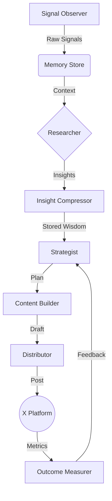

# Antigravity Engine 

**An Autonomous Multi-Tenant Fleet Management System for X (formerly Twitter).**

  

The **Antigravity Engine** is a sophisticated AI agent designed to autonomously manage multiple X accounts. Unlike simple scheduled bots, Antigravity uses a cognitive loop (Observe -> Research -> Strategize -> Act -> Measure) to create high-quality, context-aware content that adapts to platform trends.

## 🚀 Key Features

*   **Multi-Tenant Architecture**: Manage 5-6 distinct accounts (personas) from a single deployment, with isolated rate limits and memory.
*   **Cognitive Loop**:
    *   **Signal Observer**: Watches timelines and mentions for trends.
    *   **Researcher**: Uses RAG + LLMs to analyze source material.
    *   **Strategist**: Applies "Hooks" and psychological patterns to content.
    *   **Algorithm Adaptor** (In Progress): Self-tunes strategy based on platform algorithm news.
*   **Safety First**:
    *   Strict, adjustable Rate Limiting (Monthly/Daily caps).
    *   Proxy support for IP isolation.
    *   "Shadow Mode" for dry-run testing.
*   **Multimodal Capabilities**:
    *   Text generation via Gemini Pro.
    *   *Coming Soon*: Image generation and visual memes.

## 🛠️ Architecture

The system is built on a modular Python architecture:



## 📦 Installation

### Prerequisites
*   Python 3.10+
*   Docker (optional, for deployment)
*   X Developer Account (API Keys)
*   Google Gemini API Key

### Setup

1.  **Clone the Repository**
    ```bash
    git clone https://github.com/RavenRepo/x-automation.git
    cd x-automation
    ```

2.  **Install Dependencies**
    ```bash
    pip install -r requirements.txt
    ```

3.  **Configuration**
    Copy the example config and edit it with your credentials:
    ```bash
    cp accounts.yaml.example accounts.yaml
    cp .env.example .env 
    ```

4.  **Run the Fleet**
    ```bash
    python -m src.core.fleet_manager
    ```

## ⚠️ Anti-Patterns (Safety Guide)

Running a bot fleet is high-risk. To avoid bans:
*   **Do NOT** run >3 accounts on a single IP (Use Proxies).
*   **Do NOT** have your accounts like/retweet each other (Cross-Interaction).
*   **Do NOT** stick to fixed schedules (The system uses jitter automatically).

See `brain/anti_patterns_guide.md` for a full guide.

## 🤝 Contributing

1.  Fork the Project
2.  Create your Feature Branch (`git checkout -b feature/AmazingFeature`)
3.  Commit your Changes (`git commit -m 'Add some AmazingFeature'`)
4.  Push to the Branch (`git push origin feature/AmazingFeature`)
5.  Open a Pull Request

## 📄 License

Distributed under the MIT License. See `LICENSE` for more information.
